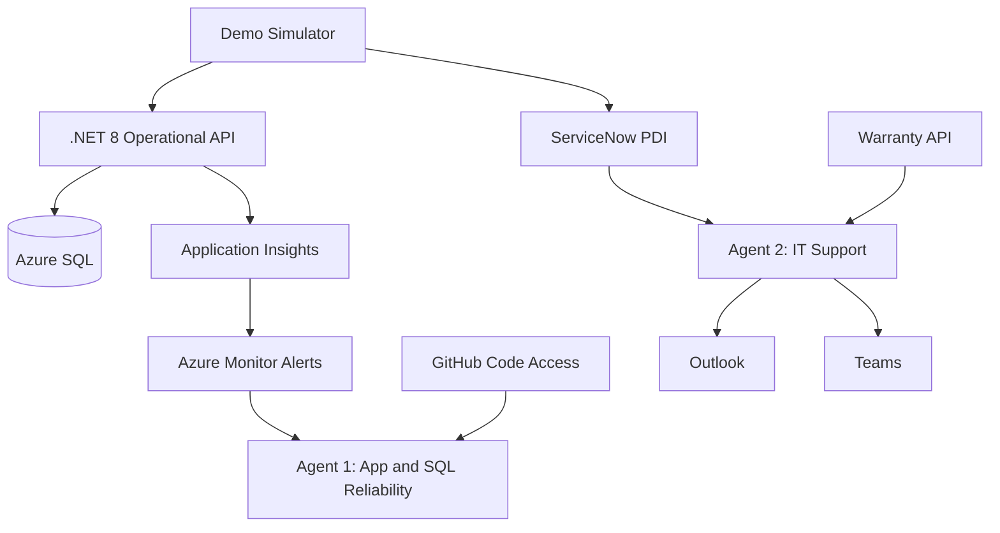

# Zava SRE Agent Demos

A deployable lab for demonstrating Azure SRE Agent investigation, governance, incident response, and bounded remediation across Azure Monitor, Azure SQL, GitHub, ServiceNow, Outlook, and Teams.

The repository contains two complementary demo agents:

| Agent | Focus | Key capabilities |
|---|---|---|
| **Agent 1** | Application and SQL reliability | Azure Monitor incidents, SQL diagnosis, deployment validation, GitHub code correlation, guarded remediation |
| **Agent 2** | IT support automation | ServiceNow incidents, warranty decisions, VPN diagnosis, Outlook and Teams notifications, scheduled support reviews |

The Zava Wellbeing portal is a sample workload, not the scope of the whole repository.

## Demo Scenarios

| # | Scenario | Agent | Trigger | Outcome |
|---:|---|---|---|---|
| 1 | Slow SQL query | Agent 1 | Azure SQL DTU alert | Diagnose a missing index and propose remediation |
| 2 | SQL blocking chain | Agent 1 | Simulator or guided test | Identify the head blocker and propose a guarded fix |
| 3 | Bad deployment | Agent 1 | GitHub or direct thread | Correlate failed health checks with deployment changes |
| 4 | Laptop support | Agent 2 | ServiceNow incident | Choose repair, replacement, or asset verification from warranty evidence |
| 5 | HTTP deployment trigger | Agent 1 | SRE Agent HTTP trigger | Investigate a failed deployment without GitHub Actions |
| 6 | Combined demonstration | Both | Simulator launcher | Launch scenarios 1, 5, and 4 |
| 7 | Reset | N/A | Simulator reset | Restore application configuration and demo state |
| 8 | VPN support | Agent 2 | ServiceNow incident | Apply bounded runbooks or escalate sensitive failures |

## Prerequisites

- Azure subscription and permission to create resources
- Azure CLI 2.60 or later
- .NET 8 SDK
- Python 3.11 or later
- Node.js 18 or later
- Access to [Azure SRE Agent](https://sre.azure.com)
- Optional ServiceNow Personal Developer Instance for Agent 2 demos

## Quick Start

```powershell
git clone https://github.com/maihh97/zava-sre-agent-demos.git
cd zava-sre-agent-demos

az login

./infra/deploy.ps1 `
  -ResourceGroup rg-zava `
  -Location westus2 `
  -SqlLocation westeurope `
  -Prefix zava956235
```

The deployment uses managed identity, Microsoft Entra authentication, a private Azure SQL endpoint, and App Service VNet integration. It does not create SQL passwords or public SQL firewall rules.

Verify the deployment:

```powershell
Invoke-RestMethod https://app-zava956235.azurewebsites.net/health
Invoke-RestMethod https://app-zava956235-warranty.azurewebsites.net/health
```

Expected main API response:

```json
{"status":"healthy","database":"connected"}
```

## Run the Simulator

```powershell
pip install -r simulator/requirements.txt
python simulator/demo.py
```

Run one scenario directly:

```powershell
python simulator/demo.py 1
python simulator/demo.py 4
python simulator/demo.py 5
python simulator/demo.py 7
```

> Scenarios 1 and 2 require private network access to Azure SQL and Entra-capable SQL authentication. Scenarios 4 and 5 can run without opening SQL to the public internet.

<details>
<summary><strong>Architecture and deployed resources</strong></summary>



| Resource | Name or URL |
|---|---|
| Main API | `https://app-zava956235.azurewebsites.net` |
| Zava portal | `https://app-zava956235-itportal.azurewebsites.net` |
| Warranty API | `https://app-zava956235-warranty.azurewebsites.net` |
| SQL server | `sql-zava956235.database.windows.net` |
| SQL database | `sqldb-zava956235` |
| Application Insights | `ai-zava956235` |
| Log Analytics | `law-zava956235` |
| Agent 1 | `zava-sreagent-1` |
| Agent 2 | `zava-sreagent-2` |

Repository areas:

| Path | Purpose |
|---|---|
| `infra/` | Bicep deployment and database seed data |
| `src/` | .NET operational API |
| `laptop-request-site/` | Sample Zava portal and laptop request form |
| `warranty-tool/` | Warranty lookup API |
| `simulator/` | Repeatable demo triggers and reset workflow |
| `sre-config/agent1/` | Agent 1 agents, skills, hooks, tools, and schedules |
| `sre-config/agent2/` | Agent 2 agents, skills, tools, and schedules |

</details>

<details>
<summary><strong>Scenario walkthroughs</strong></summary>

### 1. Slow SQL Query

```powershell
python simulator/demo.py 1
```

The simulator generates category queries against `Products`. Azure Monitor activates Agent 1, which uses SQL diagnosis skills and change-risk controls to identify and propose the missing index.

### 2. SQL Blocking Chain

```powershell
python simulator/demo.py 2
```

The workflow identifies blocked sessions, the head blocker, wait duration, and impact. Session termination remains approval-gated.

### 3. Bad Deployment

```powershell
python simulator/demo.py 3
```

This path requires a GitHub Actions deployment workflow plus repository and trigger configuration. Agent 1 checks health, correlates the failure with code or configuration changes, and proposes recovery.

### 4. Laptop Support

Create a priority `3` ServiceNow incident assigned to `IT Support`. The short description must contain `Laptop replacement request`.

Use one of these serial numbers to demonstrate different decisions:

| Serial number | Expected branch |
|---|---|
| `SN-2023-XPS-4471` | Expired warranty, replacement eligible |
| `SN-2024-MBP-8832` | Active warranty, recommend repair |
| `SN-UNKNOWN-9999` | Unknown asset, request serial verification |

### 5. HTTP Deployment Trigger

```powershell
$env:ZAVA_RESOURCE_GROUP = "rg-zava"
$env:ZAVA_APP_NAME = "app-zava956235"
$env:ZAVA_APP_URL = "https://app-zava956235.azurewebsites.net"
$env:ZAVA_SRE_TRIGGER_URL = "<trigger-url>"
python simulator/demo.py 5
```

Press `b` to inject the controlled failure and `f` to restore configuration manually.

### 6. Combined Demonstration

```powershell
python simulator/demo.py 6
```

This launches scenarios 1, 5, and 4. Use it only when SQL private connectivity and ServiceNow are both ready.

### 7. Reset

```powershell
python simulator/demo.py 7
```

Reset restores the managed-identity connection string, restarts the app, and verifies health.

### 8. VPN Support

Create a priority `3` ServiceNow incident assigned to `IT Support` with a short description containing `VPN connectivity issue`.

| Error | Agent behavior |
|---|---|
| `809` | Network reachability runbook; eligible for Review-mode resolution |
| `720` | Client protocol runbook; eligible for Review-mode resolution |
| `691` | Authentication guidance; leave open for Identity and Access Management |
| Certificate error | Preserve security controls and escalate to Endpoint Engineering |
| Unknown error | Leave open and route to Network Operations |

The agent never requests passwords, MFA codes, recovery codes, tokens, or private keys.

</details>

<details>
<summary><strong>Agent configuration and integrations</strong></summary>

### Agent 1

Configure `zava-sreagent-1` for Azure Monitor incidents in Review mode.

- Attach Application Insights and Log Analytics.
- Add SQL MCP only from a host with access to `vnet-zava956235`.
- Add the GitHub repository under **Builder > Code Access** for source correlation.
- Route DTU alerts to `sql-performance-investigator`.
- Route deployment triggers and health failures to `deployment-validator`.

Agent 1 includes:

- SQL query and blocking diagnosis skills
- Guarded SQL remediation skills
- Change-risk and SQL write hooks
- Deployment validation agents
- Weekly cost reporting

### Agent 2

Configure `zava-sreagent-2` for ServiceNow incidents in Review mode.

- ServiceNow assignment group: `IT Support`
- Laptop title filter: `Laptop replacement request`
- VPN title filter: `VPN connectivity issue`
- Priority: `3`
- Outlook and Teams operations remain approval-controlled

Agent 2 includes:

- `CheckWarranty` and `DiagnoseVpnIssue` tools
- Device and VPN triage skills
- Weekday IT support queue review at 13:00 UTC
- Weekly IT support trends report on Monday at 09:30 UTC

The scheduled tasks are report-only. They do not acknowledge, update, resolve, reassign, or notify from ServiceNow.

### Environment Variables

```powershell
$env:ZAVA_RESOURCE_GROUP = "rg-zava"
$env:ZAVA_APP_NAME = "app-zava956235"
$env:ZAVA_SQL_SERVER = "sql-zava956235.database.windows.net"
$env:ZAVA_SQL_DATABASE = "sqldb-zava956235"
$env:ZAVA_APP_URL = "https://app-zava956235.azurewebsites.net"
$env:ZAVA_SRE_TRIGGER_URL = "<HTTP trigger URL>"
$env:ZAVA_GH_REPO = "maihh97/zava-sre-agent-demos"
$env:ZAVA_SN_URL = "https://devXXXXXX.service-now.com"
```

Enter secrets only through secure local prompts or managed connector flows. Do not commit them or paste them into chat.

</details>

<details>
<summary><strong>Troubleshooting</strong></summary>

### SQL MCP Cannot Connect

- Confirm the MCP host can reach `vnet-zava956235`.
- Use Microsoft Entra authentication.
- Do not add a public SQL firewall rule.
- Verify the main API reports `database: connected`.

### Alert Does Not Fire

- Confirm the alert rule is enabled.
- Check the five-minute evaluation window.
- Verify DTU alert threshold is restored to `80` after demos.
- Keep load active long enough for both Azure Monitor and the SRE Agent scanner.

### ServiceNow Ticket Is Not Processed

- Confirm Agent 2 reports ServiceNow as connected.
- Use assignment group `IT Support` and priority `3`.
- Match the configured laptop or VPN title phrase exactly.
- Allow the incident scanner time to index a newly created ticket.

### App Remains Unhealthy After a Failure Demo

```powershell
python simulator/demo.py 7
Invoke-RestMethod https://app-zava956235.azurewebsites.net/health
```

Confirm `DefaultConnection` uses the correct SQL hostname and `Authentication=Active Directory Managed Identity`.

</details>

## Safety and Cleanup

- Keep both agents in **Review** mode for demonstrations.
- Use least-privilege connector permissions.
- Never store ServiceNow, GitHub, Microsoft 365, or Azure credentials in the repository.
- Treat demo incident data as non-production data.
- Delete the resource group when the lab is no longer needed:

```powershell
az group delete --name rg-zava --yes --no-wait
```

This repository is a demonstration environment for Azure SRE Agent.
